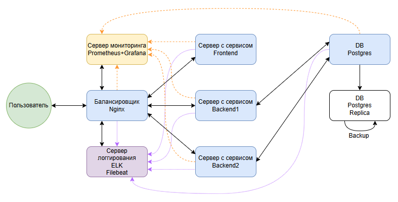

# Проектная работа курса "Administrator Linux. Basic" (группа OTUS Linux Base-2024-07)

## План аварийного восстановления web-приложения

### 1. Инфраструктура приложения

### 2. Предусловия:
Восемь серверов с обновленными пакетами, с предустановленным временем, с установленными пакетными приложениями, настроенным доступом:
#### 1. Cервер DB с пользователем db_admin:

| Описание                                          | Команда                                                                                                                          |
|---------------------------------------------------|----------------------------------------------------------------------------------------------------------------------------------|
| Обновление пакетов                                | sudo apt upgrade                                                                                                                 |
| Установка времени                                 | sudo timedatectl set-timezone Europe/Moscow                                                                                      |
| Добавление источника пакетов в список разрешенных | sudo sh -c 'echo "deb http://apt.postgresql.org/pub/repos/apt $(lsb_release -cs)-pgdg main" > /etc/apt/sources.list.d/pgdg.list' |
| Скачивание исходника                              | wget -qO - https://www.postgresql.org/media/keys/ACCC4CF8.asc \| sudo apt-key add -                                              | sudo apt-key add -                                               |
| Обновление информации о пакетах                   | sudo apt update                                                                                                                  |
| Установка                                         | sudo apt install postgresql-17                                                                                                   |
| Проверка                                          | psql --version                                                                                                                   |

#### 2. Cервер Replica с пользователем replica_admin:

| Описание                                          | Команда                                                                                                                          |
|---------------------------------------------------|----------------------------------------------------------------------------------------------------------------------------------|
| Обновление пакетов                                | sudo apt upgrade                                                                                                                 |
| Установка времени                                 | sudo timedatectl set-timezone Europe/Moscow                                                                                      |
| Добавление источника пакетов в список разрешенных | sudo sh -c 'echo "deb http://apt.postgresql.org/pub/repos/apt $(lsb_release -cs)-pgdg main" > /etc/apt/sources.list.d/pgdg.list' |
| Скачивание исходника                              | wget -qO - https://www.postgresql.org/media/keys/ACCC4CF8.asc \| sudo apt-key add -                                              | sudo apt-key add -                                               |
| Обновление информации о пакетах                   | sudo apt update                                                                                                                  |
| Установка                                         | sudo apt install postgresql-17                                                                                                   |
|                                                   | psql --version                                                                                                                   |

#### 3. Cервер Backend1 с пользователем backend1_admin:

| Описание                         | Команда                                                                              |
|----------------------------------|--------------------------------------------------------------------------------------|
| Обновление пакетов               | sudo apt upgrade                                                                     |
| Установка времени                | sudo timedatectl set-timezone Europe/Moscow                                          |
| Установка git                    | sudo apt install git-all                                                             |
| Скачивание проекта с подмодулями | mkdir ~/project && cd "$_"                                                           |
|                                  | git clone --recursive https://github.com/pupovdenis/otus-linux-basic-common-repo.git |
| Установка java                   | sudo apt install openjdk-17-jdk                                                      |
| Установка сборщика               | sudo apt install gradle                                                              |
|                                  | gradle -v                                                                            |

#### 4. Cервер Backend2 с пользователем backend2_admin:

| Описание                         | Команда                                                                              |
|----------------------------------|--------------------------------------------------------------------------------------|
| Обновление пакетов               | sudo apt upgrade                                                                     |
| Установка времени                | sudo timedatectl set-timezone Europe/Moscow                                          |
| Установка git                    | sudo apt install git-all                                                             |
| Скачивание проекта с подмодулями | mkdir ~/project && cd "$_"                                                           |
|                                  | git clone --recursive https://github.com/pupovdenis/otus-linux-basic-common-repo.git |
| Установка java                   | sudo apt install openjdk-17-jdk                                                      |
| Установка сборщика               | sudo apt install gradle                                                              |
|                                  | gradle -v                                                                            |

#### 5. Cервер Frontend с пользователем frontend_admin:

| Описание                                     | Команда                                                                              |
|----------------------------------------------|--------------------------------------------------------------------------------------|
| Обновление пакетов                           | sudo apt upgrade                                                                     |
| Установка времени                            | sudo timedatectl set-timezone Europe/Moscow                                          |
| Установка git                                | sudo apt install git-all                                                             |
| Скачивание проекта с подмодулями             | mkdir ~/project && cd "$_"                                                           |
|                                              | git clone --recursive https://github.com/pupovdenis/otus-linux-basic-common-repo.git |
| Установка nodejs                             | sudo apt install nodejs                                                              |
| Установка npm (пакетный менеджер для nodejs) | sudo apt install npm                                                            |

#### 6. Cервер Gateway с пользователем gateway_admin:

| Описание                                    | Команда                                                                              |
|---------------------------------------------|--------------------------------------------------------------------------------------|
| Обновление пакетов                          | sudo apt upgrade                                                                     |
| Установка времени                           | sudo timedatectl set-timezone Europe/Moscow                                          |
| Установка nginx                             | sudo apt install nginx                                                           |

#### 7. Cервер Monitor с пользователем monitor_admin:

| Описание                         | Команда                                                                              |
|----------------------------------|--------------------------------------------------------------------------------------|
| Обновление пакетов               | sudo apt upgrade                                                                     |
| Установка времени                | sudo timedatectl set-timezone Europe/Moscow                                          |
| Установка prometheus             | sudo apt install prometheus                                                           |
| Установка grafana                | wget https://dl.grafana.com/oss/release/grafana_11.1.0_amd64.deb                                                          |
|                                  | sudo apt-get install -y adduser libfontconfig1 musl                                                         |
|                                  | sudo dpkg -i grafana_11.1.0_amd64.deb                                                        |
|                                  | sudo /bin/systemctl daemon-reload                                                       |
|                                  | sudo /bin/systemctl enable grafana-server                                                    |
|                                  | sudo /bin/systemctl start grafana-server                                                      |

#### 8. Cервер Logger с пользователем logger_admin:

| Описание                                | Команда                                                                              |
|-----------------------------------------|--------------------------------------------------------------------------------------|
| Обновление пакетов                      | sudo apt upgrade                                                                     |
| Установка времени                       | sudo timedatectl set-timezone Europe/Moscow                                          |
| Скачивание дистрибутива (Elastic stack) |  wget https://cdn.otus.ru/media/public/fc/7a/elk_8.9_deb-224190-fc7a18.zip                                                           |
| Распаковка дистрибутива                 | sudo apt install unzip                                                            |
|                                         | sudo unzip elk_8.9_deb-224190-fc7a18.zip                                                            |
| Установка jdk                           | sudo apt install default-jdk -y                                                            |
| Установка elasticsearch                 | sudo dpkg -i elk-8.9-deb/elasticsearch-8.9.1-amd64.deb                                                            |
| Установка kibana                        | sudo dpkg -i elk-8.9-deb/kibana-8.9.1-amd64.deb                                                            |
| Установка logstash                      | sudo dpkg -i elk-8.9-deb/logstash-8.9.1-amd64.deb                                                            |

### 3. Настройка DB и Replica:

#### DB

| Описание               | Команда                                                                                  |
|------------------------|------------------------------------------------------------------------------------------|
| Создание бд            | sudo -u postgres psql                                                                    |
|                        | CREATE DATABASE project_db;                                                              |
|                        | ALTER USER postgres WITH PASSWORD 'postgres';                                            |
| Настройка конфигурации | sudo nano /etc/postgresql/17/main/postgresql.conf                                        |
|                        | раскомментировать и заменить listen_addresses = '*'                                      |
|                        | раскомментировать archive_mode = on                                                      |
|                        | раскомментировать и заменить archive_command = 'cp %p /var/lib/postgresql/17/archive/%f' |
|                        | раскомментировать max_wal_senders = 10                                                   |
|                        | раскомментировать wal_level = replica                                                    |
|                        | изменить ssl = off                                                                       |
|                        | sudo nano /etc/postgresql/17/main/pg_hba.conf                                            |
|                        | добавить host replication all {Replica ip}/{mask} scram-sha-256                          |
|                        | добавить host project_db postgres {Backend1 ip}/{mask} md5                               |
|                        | добавить host project_db postgres {Backend2 ip}/{mask} md5                               |
|                        | sudo systemctl restart postgresql                                                        |
|   Настройка доступa    | sudo mkdir -p /var/lib/postgresql/17/archive                                             |
|                        | sudo chown -R postgres:postgres /var/lib/postgresql/17/archive                           |
|                        | sudo systemctl reload postgresql                                                         |

#### Replica

| Описание               | Команда                                                                                                                          |
|------------------------|----------------------------------------------------------------------------------------------------------------------------------|
| Настройка конфигурации | sudo systemctl stop postgresql                                                                                                   |
|                        | sudo nano /etc/postgresql/17/main/postgresql.conf                                                                                |
|                        | primary_conninfo = 'host={DB ip} port=5432 user=postgres password=postgres'                                                      |
|                        | restore_command = 'cp /var/lib/postgresql/17/archive/%f %p'                                                                      |
|                        | раскомментировать и заменить listen_addresses = '*'                                                                              |
|                        | sudo chmod -R 777 /var/lib/postgresql/17/main                                                                                    |
|                        | sudo -u postgres rm -rf /var/lib/postgresql/17/main/*                                                                            |
|                        | sudo chmod -R 700 /var/lib/postgresql/17/main                                                                                    |
|                        | sudo chown -R postgres:postgres /var/lib/postgresql/17/main                                                                      |
|                        | sudo -u postgres pg_basebackup -R -h {DB ip} -D /var/lib/postgresql/17/main -U postgres -P                                       |
|                        | sudo systemctl restart postgresql                                                                                                |
| Настройка backup       | sudo nano /etc/postgresql/17/main/pg_hba.conf                                                                                    |
|                        | заменить  local all postgres peer = local all postgres md5                                                                       |
|                        | sudo systemctl restart postgresql                                                                                                |
|                        | sudo mkdir /var/backups/postgresql                                                                                               |
|                        | sudo chown -R postgres:postgres /var/backups/postgresql/                                                                         |
|                        | sudo touch /var/backups/postgresql/backup.sh                                                                                     |
|                        | sudo nano /var/backups/postgresql/backup.sh [backup.sh](etc%2Fscripts%2Fbackup.sh)                                               |
|                        | sudo chmod +x /var/backups/postgresql/backup.sh                                                                                  |
|                        | sudo crontab -e */10 * * * * /var/backups/postgresql/backup.sh > /var/backups/postgresql/cron_backup.log 2>&1 [каждые 10мин] |
|                        | sudo -u postgres psql -c '\l'                                                                                                    |

### 4. Настройка Backend1  и Backend2:

| Описание          | Команда                                                                                                                                                         |
|-------------------|-----------------------------------------------------------------------------------------------------------------------------------------------------------------|
| Сборка приложения | sudo chmod +x ~/project/otus-linux-basic-common-repo/backend/gradlew                                                                                            |
|                   | cd ~/project/otus-linux-basic-common-repo/backend/                                                                                                              |
|                   | ./gradlew build                                                                                                                                                 |
| Запуск приложения | screen -S me                                                                                                                                                    |
|                   |                                                                                                                                                                 |
|                   | nohup java -DDATASOURCE_HOST={DB ip} -DDATASOURCE_USERNAME=postgres -jar ~/project/otus-linux-basic-common-repo/backend/build/libs/backend-0.0.1-SNAPSHOT.jar & |
|                   | sudo ss -ntlp                                                                                                                                                   | grep LISTEN                                                                                                                                                  |
|                   | curl http://localhost:7777/persons                                                                                                                                                   | grep LISTEN                                                                                                                                                  |

### 5. Настройка Frontend:

| Описание                     | Команда                                                |
|------------------------------|--------------------------------------------------------|
| Cоздание файла с переменными | cd ~/project/otus-linux-basic-common-repo              |
|                              | git submodule update --remote --merge                  |
|                              | cd frontend                                            |
|                              | sudo cat > .env                                        |
|                              | PORT=4200                                              |
|                              | REACT_APP_API_BASE_URL=http://{gateway ip}/api/persons |
| Установка пакетов приложения | sudo npm install                                       |
| Сборка приложения            | sudo npm run build                                     |
| Запуск приложения            | screen -S me                                           |
|                              | sudo npm run start &                                   |
|                              | curl http://localhost:4200                             |
|                              | curl http://{Frontend ip}:4200                         |

### 6. Настройка Gateway:

| Описание                       | Команда                                                                              |
|--------------------------------|--------------------------------------------------------------------------------------|
| Настройка конфигурации         | sudo nano /etc/nginx/sites-available/default                                         |
|                                | комментируем блок server, добавляем [sites-available](etc%2Ffiles%2Fsites-available) |
|                                | sudo nginx -t                                                                        |
|                                | sudo service nginx restart                                                           |
|                                | http://{Monitor ip}/                                                                 |
| Установка exporter для Monitor | sudo apt install prometheus-node-exporter                                                                |

##### Настройка сети

todo

### 7. Настройка Monitor:

| Описание                           | Команда                                                                                                                                                                                                                                          |
|------------------------------------|--------------------------------------------------------------------------------------------------------------------------------------------------------------------------------------------------------------------------------------------------|
| Настройка конфигурации             | sudo nano /etc/prometheus/prometheus.yml                                                                                                                                                                                                         |
|                                    | Добавить    - job_name: node_gateway   static_configs:  - targets: ['{gateway ip}:9100']                                                                                                                                             |
| Перезапуск prometheus              | kill -HUP  {pid prometheus}                                                                                                                                                                                                                      |
| Установка агента на целевой сервер | sudo apt install prometheus-node-exporter                                                                                                                                                                                                        |
| Настройка подключений к данным     | http://{Monitor ip}:3000   > admin/admin > skip   > Home/Connections/Data sources > add Prometheus > Prometheus server URL* = http://localhost:9090 > save & test   > Dashboards > New > Import > ссылка > Node Exporter Full > ID 1860 в load > привязка источника данных |

### 8. Настройка Logger:

Elasticsearch

| Описание                      | Команда                                                                                                                                                                                                                                                                  |
|-------------------------------|--------------------------------------------------------------------------------------------------------------------------------------------------------------------------------------------------------------------------------------------------------------------------|
| Настройка конфигурации        | sudo chmod -R 777 /etc/elasticsearch/                                                                                                                                                                                                                                    |
|                               | прописать для jvm лимиты по потреблению ОЗУ: sudo cat > /etc/elasticsearch/jvm.options.d/jvm.options -Xms1g -Xmx1g                                                                                                                                           |
|                               | настроить запуск: 	sudo nano /etc/elasticsearch/elasticsearch.yml 		xpack.security.enabled: false 		... 	xpack.security.http.ssl: 		enabled: false 	... 	xpack.security.transport.ssl: 		enabled: false 	... 	http.host: 0.0.0.0 |
|                               | sudo systemctl daemon-reload                                                                                                                                                                                                                                             |
|                               | sudo systemctl enable --now elasticsearch.service                                                                                                                                                                                                                        |
|                               | curl http://localhost:9200                                                                                                                                                                                                                                               |

Kibana

| Описание                        | Команда                                                                                                                                                                                                                                                                  |
|---------------------------------|--------------------------------------------------------------------------------------------------------------------------------------------------------------------------------------------------------------------------------------------------------------------------|
| Настройка конфигурации          | sudo systemctl daemon-reload                                                                                                                                                                                                                                             |
|                                 | sudo systemctl enable --now kibana.service                                                                                                                                                                                                                               |
|                                 | настроить запуск: 	sudo chmod -R 777 /etc/kibana/ 	sudo nano /etc/kibana/kibana.yml server.port: 5601  server.host: "0.0.0.0"                                                                                                                            |
|                                 | sudo systemctl restart kibana                                                                                                                                                                                                                                            |

Logstash

| Описание                            | Команда                                                                                                         |
|-------------------------------------|-----------------------------------------------------------------------------------------------------------------|
| Настройка конфигурации              | sudo systemctl enable --now logstash.service                                                                    |
|                                     | sudo chmod -R 777 /etc/logstash/                                                                                |
|                                     | nano /etc/logstash/logstash.yml path.config: /etc/logstash/conf.d                                           |
| Настройка файлов logstash для nginx | sudo cat > /etc/logstash/conf.d/logstash-nginx-es.conf [logstash-nginx-es](etc%2Ffiles%2Flogstash-nginx-es) |
|                                     | sudo systemctl restart logstash.service                                                                         |

#### Установка и настройка filebeat на примере nginx

Gateway

| Описание           | Команда                                                                                                                                                                                                    |
|--------------------|------------------------------------------------------------------------------------------------------------------------------------------------------------------------------------------------------------|
| Установка filebeat | скачать filebeat-8.9.1-amd64.deb с Logger                                                                                                                                                                  |
|                    | sudo dpkg -i filebeat-8.9.1-amd64.deb                                                                                                                                                                      |
| Настройка filebeat | sudo chmod -R 777 /etc/filebeat/                                                                                                                                                                           |
|                    | sudo nano /etc/filebeat/filebeat.yml  добавить в filebeat.inputs [filebeat](etc%2Ffiles%2Ffilebeat)                                                                                                    |
|                    | sudo systemctl restart filebeat                                                                                                                                                                            |
| Проверка           | browser http://{Logger ip}:5601  > Explore on my own > Menu > Discover > Add integrations > Create data view > Name: Nginx, Index patten: weblogs*                                                     |
|                    | на Gateway: sudo apt install apache2-utils ab -n 150 http://{Logger ip} Management > Stack Management > Index Management > Analytics > Dashboard > Create a dashboard > Create vizualization > |

### Проверка

| Описание                              | Команда                                                                                                                                                                               |
|---------------------------------------|---------------------------------------------------------------------------------------------------------------------------------------------------------------------------------------|
| Проверка доступа Frontend             | http:/<gateway ip>/api/persons                                                                                                                                                        |
| Создать запись в бд через Backend1    | curl --header "Content-Type: application/json"  --request POST --data '{"firstname":"firstname1","lastname":"lastname1", "biography":"bio1"}'  http:/<gateway ip>/api/persons |
| Создать запись в бд через Backend2    | curl --header "Content-Type: application/json"  --request POST --data '{"firstname":"firstname2","lastname":"lastname2", "biography":"bio2"}'  http:/<gateway ip>/api/persons |
| Создать backup на Replica             | pg_dump -U postgres -F c -b -v -f "/var/backups/postgresql/project_db_backup.sql" project_db                                                                                          |
| Очистить бд                           | curl --header "Content-Type: application/json"  --request DELETE  http:/<public gateway ip>/api/persons/<id>                                                                  |
| Накатить backup на Replica            | sudo /var/backups/restore.sh /var/backups/postgresql/<backup filename>                                                                                                                |
| Проверка записей с backup на Frontend | http:/<gateway ip>/api/persons                                                                                                                                                        |
